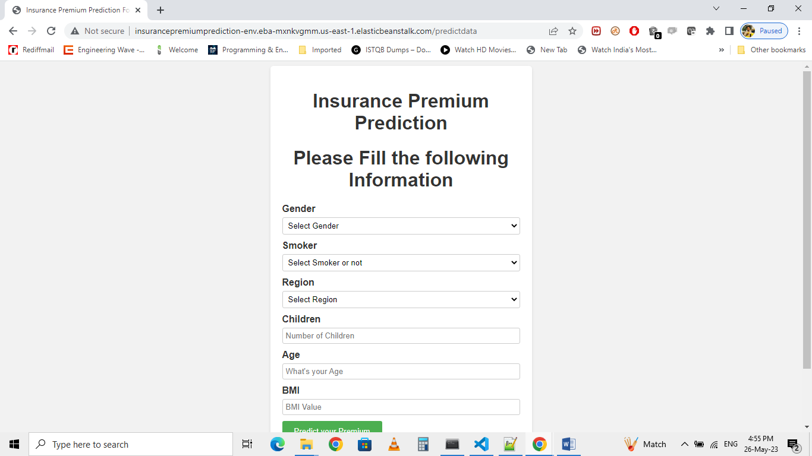

# Insurance-Premium-Prediction
# End to End Machine Learning Project
The goal of this project is to give people an estimate of how much premium they need as an Health Insurance based on their individual health situation.

#### Life cycle of Machine learning Project

- Understanding the Problem Statement
- Data Collection
- Data Checks to perform
- Exploratory data analysis
- Data Pre-Processing
- Model Training
- Choose best model

### 1) Problem statement
- The goal of this project is to give people an estimate of how much they need based on their individual health situation. After that, customers can work with any health insurance carrier and its plans and perks while keeping the projected cost from our study in mind. This can assist a person in concentrating on the health side of an insurance policy rather han the ineffective part.

### 2) Data Collection
- Dataset Source - https://www.kaggle.com/datasets/noordeen/insurance-premium-prediction
- The data consists of 7 column and 1339 rows.

### 3) Model Workflow

3.1 Model Selection

●	After this the data was split into 2 sets X and y. X contains all the columns except the target column in our case (Count), y contains only the Target column.
●	Using train test split we first split the dataset into X_train,X_test, y_train, y_test .
●	 The following libraries were imported to create Regression models.
○	from sklearn.ensemble import(AdaBoostRegressor,  GradientBoostingRegressor, RandomForestRegressor)
○	from sklearn.tree import DecisionTreeRegressor
○	from xgboost import XGBRegressor
○	from sklearn.linear_model import LinearRegression
		
3.2 Model Accuracy Scores.

●	Random Forest Regressor has been chosen as the final algorithm to build the model
○	MAE: 1043.67
○	RMSE: 1883.04
○	Test>R-Squared Accuracy: 0.8603
○	Train> R-Squared Accuracy: 0.9754

●	The model was pickled using the Python pickle library and was ready for use into our Backend system. 

### 4) Deployment

This model is deployed on AWS EC2 instances. The following are the steps to deploy the model on the AWS platform:
●	Create an AWS account
●	Create an ECR
●	Create S3 bucket
●	Create an EC2 instance
●	Edit security group
●	Connect to an EC2 instance
●	Add the runner in the GitHub
●	Add all the secret keys in the GitHub
●	In the GitHub actions, run the continuous delivery and deployment workflow once after starting the runner in the ec2 instance
●	A web page  has been created and deployed using flask

Application is deployed at URL: 
http://insurancepremiumprediction-env.eba-mxnkvgmm.us-east-1.elasticbeanstalk.com/predictdata

Note - This URL might not work as AWS is charging me amount for this URL to work so I have pasted deployment image in the file for the proof.

### 5) Conclusion
We have successfully built end-to-end ML projects using machine learning that can help predict the medical expenses of the users based on various conditions. This type of system can help users to get a better understanding of their medical expenses and based on it they can buy their insurance plan. 
